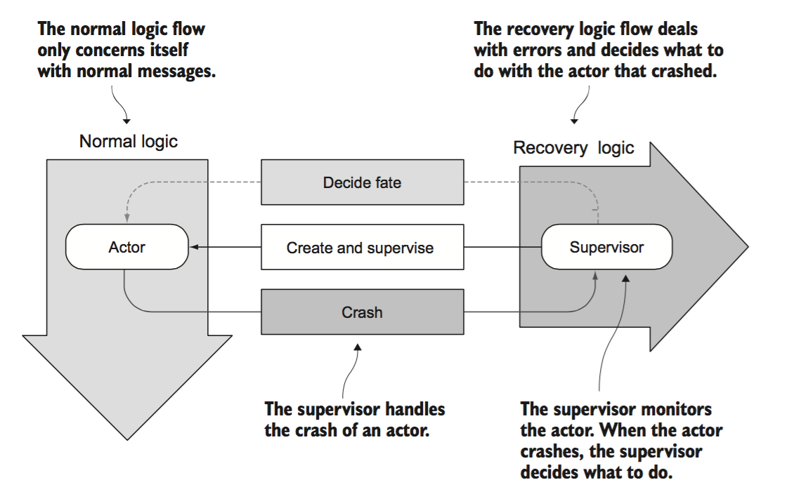
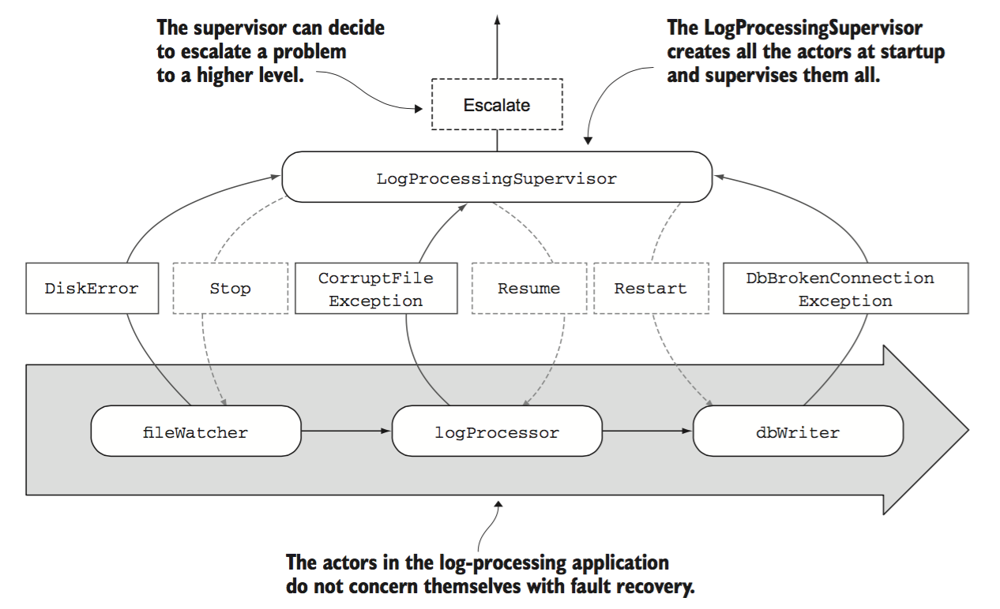
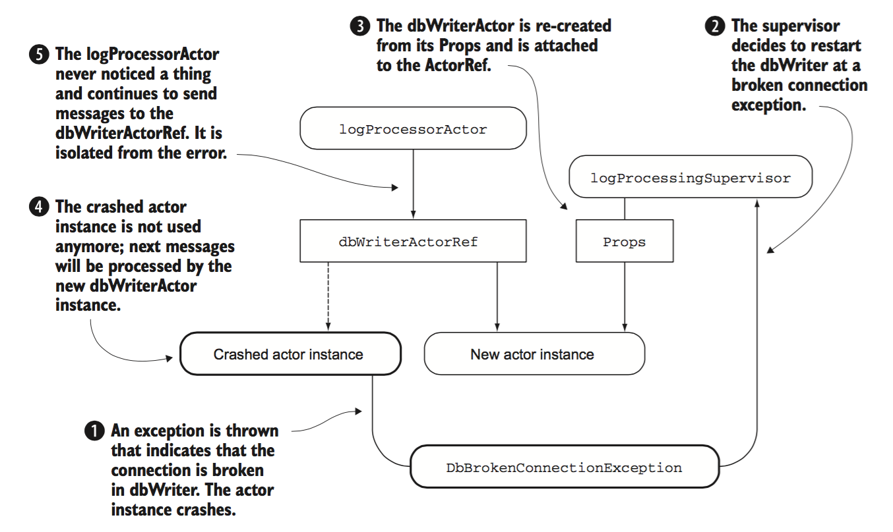
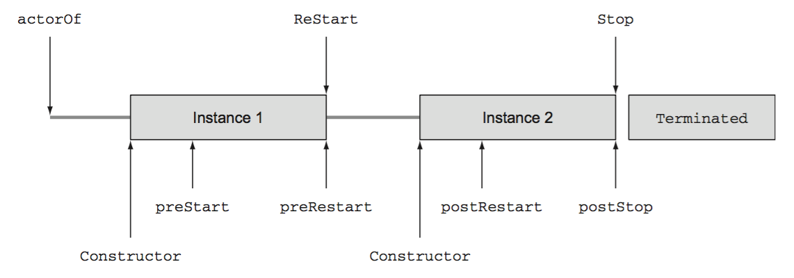

### Akka Basics
#### 1. Let it crash

Instead of using one flow to handle both normal and recovery code, Akka `Actor` provides 2 separate flows:

- __one for normal logic__, consisting of actors for handling normal messages
- __one for recovery logic__, consisting of actors that monitor actors in normal flow

Instead of catching exceptions, we will let the actor crash. The **mailbox** for crashed actor is **suspended** until supervisor in recovery flow decides what to do with exception.

#####How does an actor become a supervisor?

Akka enforces **parental supervision** i.e., any actor that creates actors automatically becomes supervisor for them. A supervisor:

- **doesn't** catch exceptions
- **decides** what should happen with the crashed actors
- **doesn't** try to fix the actor or its state
- **renders** judgement and **triggers** corresponding strategy



Supervisor has 4 options to decide what to do with actor:

- **Restart** - actor must be re-created from its `Props`. After restarting, actor will be able to process messages. Since rest of app uses `ActorRef`, new actor instance will automatically get next messages.
- **Resume** - same actor should continue to process messages; crash is ignored
- **Stop** - actor must be terminated; no longer takes part in processing messages
- **Escalate** - supervisor doesn't know what to do and escalates to parent

Example log-processor



The above solution gives way to deal with broken connection problem. When `DbBrokenConnectionException` occurs, `dbWriter` actor crashes and replaced with re-created actor.

If a corrupt message caused an exception, then re-processing corrupt messages could lead to **poisoned mailbox** - no other message gets processed as corrupted message fails again and again. For this reason, Akka chooses not to provide failing message to mailbox after restart.

Following shows how crashed `dbWriter` instance is replaced with fresh instance when supervisor chooses to restart.



##### Benefits of Let-it-crash approach

- ***Fault isolation*** - supervisor can decide to terminate an actor, actor is removed from actor system
- ***Structure*** - actor system hierarchy of actor references makes it easier to replace actor instances without affecting other actors
- ***Redundancy*** - actor can be replaced by another. In broken db connection, fresh actor instance could connect to different db. Supervisor could decide to stop faulty actor and use another type instead.
- ***Replacement*** - actor can always be re-created from `Props`
- ***Reboot*** - can be done through a restart
- ***Component Lifecycle*** - actor is an active component, it can be started, stopped and restarted
- ***Suspend*** - when an actor crashes, its mailbox is suspended until the supervisor decides what should happen with the actor
- ***Separation of concerns*** - normal actor message processing and supervision fault recovery flows are independent

#### 2. Actor Lifecycle

One question remains, how can we correct the actor state when it's restarted? For this, we need to know the actor lifecycle.

An actor is automatically started by Akka when it's created. It remains in `Started` state until it's stopped, at which point the actor is in `Terminated` state. A terminated actor can't process messages and shall be garbage collected. When the actor is in `Started` state, it can be restarted as many times as necessary to reset the internal state.

During the lifecycle of an actor, there are 3 types of events:

- actor is created and starte - ***start*** event
- actor is restarted on ***restart*** event
- actor is stopped by ***stop*** event

There are several hooks in `Actor` trait called when events happen. We can add custom code in these hooks, for example, to process message that failed before restart, or to clean up resources.

##### Start event

Automatically started after creating actor with `actorOf` method on the `ActorSystem`. Parent actor can create child actor using `actorOf` on its `ActorContext`.

`preStart` hook is called just before the actor is started.

```scala
override def preStart() {
	println("preStart")
}
```

##### Stop event

Indicates end of actor lifecycle. Actor can be stopped using `stop` method on `ActorSystem` and `ActorContext` objects, or by sending `PoisonPill` message to actor.

`postStop` hook is called just before actor is terminated. This hook is usually used to release resources and store last state of actor in case next actor needs it.

A stopped actor is disconnected from its `ActorRef`. After actor is stopped, `ActorRef` is redirected to `deadLettersActorRef` of actor system, which is special `ActorRef` that receives all messages that are sent to dead actors.

##### Restart event

When a restart occurs, the `preRestart` method of crashed actor instance is called. It allows to store its current state just before it's replaced by new actor instance.

```scala
override def preRestart(reason: Throwable, message: Option[Any]) {
	println("preRestart")
	super.preRestart(reason, message)
}
```

The default implementation of `preRestart` stops all child actors and calls `postStop` hook. If we forget to call `super.preRestart` then this default behavior won't occur and we could end up with increasingly more child actors when the parent actor is restarted.

Important to note that restart doesn't stop crashed actor same way as stop methods. Crashed actor instance in restart doesn't cause `Terminated` message to be sent for it. The fresh actor instance, during restart, is connected to same `ActorRef` the crashed actor was using before fault.

The stopped actor and crashed actor just have one thing in common, they both call `postStop` after being cutt off from actor system.

A supervisor may choose to send the failed message to the actor's mailbox so that it will be proessed by the fresh actor instance by using `self ActorRef`. But remeber that the order of messages shall be disrupted in this case.



```scala
class LifeCycleHooks extends Actor with ActorLogging {
	System.out.println("Constructor")
	
	override def preStart() { println("preStart") }
	
	override def postStart() { println("postStart") }
	
	override def preRestart(reason: Throwable, message: Option[Any]){
		println("preRestart")
		super.preRestart(reason, message)
	}
	
	override def postRestart(reason: Throwable){
		println("postRestart")
		super.postRestart(reason)
	}
	
	def receive = {
		case "restart" =>
			throw new IllegalStateException("force restart")
		case msg: AnyRef =>
			println("Receive")
			sender() ! msg
	}
}
```

```scala
val testActorRef = system.actorOf(Props[LifeCycleHooks], "LifeCycleHooks")
testActorRef ! "restart"
testActorRef.tell("msg", testActor)
expectMsg("msg")
system.stop(testActorRef)
Thread.sleep(1000)
```

```
// Output
Constructor
preStart
preRestart force restart
postStop
Constructor
postRestart force restart
preStart
Receive
postStop
```

##### Monitoring the lifecycle

